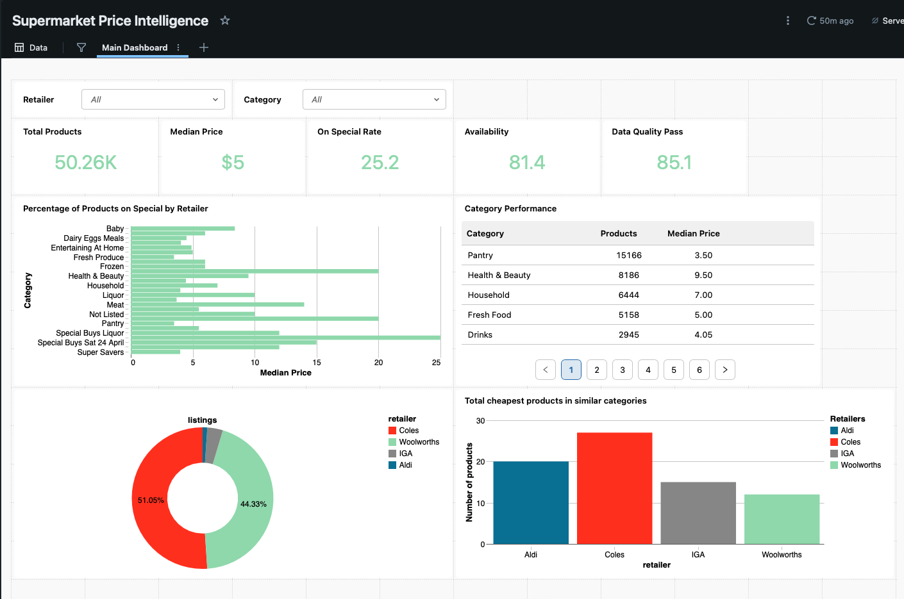

# Australian Supermarket Price-Intelligence Pipeline

A production-style **daily price-intelligence** data pipeline built on a real-world
stack: raw files land in **Amazon S3**, **Databricks** (Lakeflow Declarative Pipelines /
Delta Live Tables) runs a **Bronze → Silver → Gold** medallion, and **Databricks AI/BI
Dashboards** serve the analytics.

The interesting engineering problem: four retailers (**Aldi, Coles, IGA, Woolworths**)
publish the same concepts in **four different, messy schemas**. We integrate them into one
conformed, comparable, analytics-ready model.

## Why this is a realistic project
| Real-world concern | How it shows up here |
|---|---|
| Heterogeneous sources | 4 feeds, different columns, taxonomies & quirks → one conformed model |
| Messy data | Stringified Python lists, mixed currency units (`3c`, `$2.58`), BOM headers, null prices, cents/dollars data-entry errors, RFC-4180 quote-escaped CSV fields that shift columns if mis-parsed |
| Incremental ingestion | **Auto Loader** processes only newly-landed daily files |
| Data quality as a first-class concern | DLT expectations → **drop / quarantine / pass**; bad rows kept for review, not deleted |
| Slowly-changing data | **SCD Type 2** product dimension tracks attribute changes over time |
| Cross-source comparability | Unit prices normalised to **per-kg / per-L / per-each** |
| Governance & lineage | **Unity Catalog** + DLT lineage graph |
| Reproducible infra | **Terraform** (S3 + IAM) and **Databricks Asset Bundles** (pipeline/job/dashboard as code) |
| CI/CD | **GitHub Actions**: lint + unit tests + bundle validate |

## Architecture

```
 Source CSVs (dated)          AWS S3 (raw zone, free tier)            Databricks Lakehouse (Unity Catalog)
┌──────────────────┐  land   ┌───────────────────────────────┐     ┌──────────────────────────────────────────┐
│ aldi/coles/iga/  │ ──────▶ │ raw/<retailer>/date=YYYY-MM-DD │ ──▶ │ BRONZE  raw_<retailer>   (Auto Loader)      │
│ wow  .csv (daily)│         │       /<retailer>_<date>.csv   │     │ SILVER  fact_price + dims (conform + DQ)    │
└──────────────────┘         └───────────────────────────────┘     │ GOLD    fact_price_daily + 5 marts          │
                                                                    └──────────────────────┬─────────────────────┘
                                                                                     AI/BI Dashboard
```

### Data model (Gold star schema)
- **`fact_price_daily`** — grain: *retailer × product × day*; carries `price_aud`,
  normalised unit price, `price_change_pct` (day-over-day), FKs to all dims.
- **Dimensions** — `dim_product` (SCD2), `dim_category` (canonical 2-level taxonomy),
  `dim_retailer`, `dim_date`.
- **Marts** — `mart_price_comparison`, `mart_specials_penetration`,
  `mart_category_price_index`, `mart_availability`, `mart_dq_scorecard`.

### Cleaning & standardisation (Silver)
The Silver layer is where the four feeds are conformed and cleaned. Key design points:
- **Single source of truth** — every parsing / standardisation / data-quality function
  lives once, as a pure Python function in `src/pipelines/silver.py`. The same functions
  are unit-tested directly *and* wrapped as Spark UDFs (Databricks workers can't import a
  shared `src.common`, so a parallel copy would only drift out of sync). Heavy imports are
  guarded so the module loads in a plain pytest environment.
- **Unit-price normalisation in one pass** — a single parse yields both the display
  measure (`per_100g`) and the comparable base (`per_kg` / `per_l` / `per_each`).
- **Conformed grain** — one row per *retailer × product × day*; Woolworths' multi-value
  `Department` is collapsed to a single primary category (Tobacco/Liquor excluded) instead
  of exploding a product into several rows, keeping the SCD2 key and day-over-day `lag()`
  unambiguous.
- **Correct CSV parsing at the source** — Bronze reads with `escape="\""` so RFC-4180
  doubled-quote fields (Coles `Suppliers` lists) don't shift columns and leak supplier text
  into the category fields.
- **Defensive category mapping** — unknown tokens that look corrupt (leading digits,
  quotes, brackets) bucket to `Other` rather than surfacing as a category.

## Repository layout
```
src/ingest/land_to_s3.py   # land dated CSVs into the S3 raw zone
src/simulate/generate_days.py  # synthesize extra days (history for SCD2 / price change)
src/pipelines/bronze.py    # Auto Loader ingestion (DLT)
src/pipelines/silver.py    # conform + DQ + dimensions (DLT); pure cleaning/DQ funcs
                           #   live here (single source of truth) + are unit-tested
                           #   directly, since Databricks workers can't import src.common
src/pipelines/gold.py      # star schema + BI marts (DLT)
tests/                     # pytest unit tests for parsers & DQ rules
infra/terraform/           # S3 bucket + IAM role for the UC storage credential
databricks.yml             # Databricks Asset Bundle (pipeline + daily job + dashboard)
dashboards/dashboard.png   # AI/BI dashboard — report-style layout (screenshot)
.github/workflows/ci.yml   # lint + tests + bundle validate
```

## Setup (free tiers throughout)

### 0. Prerequisites
```bash
pip install -r requirements-dev.txt
databricks --version    # https://docs.databricks.com/dev-tools/cli
terraform -version
```

### 1. AWS S3 raw zone (Terraform)
```bash
cd infra/terraform
terraform init
terraform apply -var bucket_name=<your-unique-bucket> \
                -var unity_catalog_external_id=<from-step-2>
# outputs: raw_bucket_s3_uri, uc_role_arn
```
> The `unity_catalog_external_id` comes from the Databricks **storage credential** you
> create in step 2 — create the credential first (it generates the external ID), then
> apply Terraform, then paste `uc_role_arn` back into the credential.

### 2. Databricks Free Edition + Unity Catalog
1. Sign up for **Databricks Free Edition** (serverless; includes Unity Catalog, DLT,
   Workflows, AI/BI Dashboards).
2. Create catalog `supermarket` with schemas `bronze`, `silver`, `gold`.
3. **Connect S3:** create a UC **storage credential** (IAM role `uc_role_arn`) and an
   **external location** pointing at `s3://<bucket>/raw`.


### 3. Land the data
```bash
# real snapshot (2021-04-23)
python -m src.ingest.land_to_s3 --bucket <your-bucket> --source-dir data/raw
# (optional) synthesize a week of history, then land it too
python -m src.simulate.generate_days --start 2021-04-24 --days 7
python -m src.ingest.land_to_s3 --bucket <your-bucket> --source-dir data/synth
```

### 4. Deploy & run the pipeline
```bash
databricks bundle validate -t dev
databricks bundle deploy   -t dev
databricks bundle run price_intelligence_job -t dev
```
The daily **Workflow** (06:00 Australia/Sydney) triggers the medallion pipeline with
retries + failure email. Open the pipeline to see the Bronze→Silver→Gold lineage graph
and the DLT data-quality expectation metrics.

### 5. Dashboard
The Gold marts feed a **report-style AI/BI dashboard** that tells a complete
price-intelligence story — *scale → trend → category economics → competitive positioning*:




## Testing
```bash
pytest          # 45 unit tests over the parsing, cleaning & DQ rules
ruff check .    # lint
```


---
